# Bulgarian day-ahead electricity price — 48 h forecast

This project forecasts the hourly price on Bulgaria's day-ahead electricity market (EUR/MWh) for **tomorrow and
the day after**. It uses only public data: grid forecasts from ENTSO-E, weather from Open-Meteo,
neighbouring-market prices and gas prices.

It contains the full research workflow, documented in two Jupyter notebooks, and a program (`forecast.py`)
that turns the research into a working forecast.

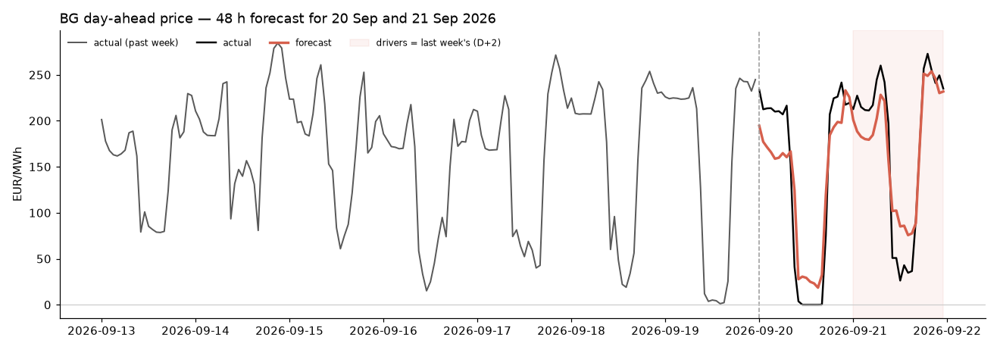

*Forecast made at 08:00 on 19 Sep 2026 for the next two days (red), with the real prices overlaid (black).
The model had never seen these two days. Reproduce it with `python forecast.py predict --demo`.*

| | |
|---|---|
| **Best model** | LightGBM, MAE **23.3 EUR/MWh** on 17 months it never saw: 18 % better than the benchmark |
| **Data** | 2017 → 2026, 82,540 usable hours, 27 features, 4 public sources |
| **Runs without a key** | cached data and a trained model ship with the repo |

**Contents:** [1. The task](#1-the-task) · [2. How the repository is organised](#2-how-the-repository-is-organised) ·
[3. Quickstart](#3-quickstart) · [4. Choosing the data](#4-choosing-the-data) ·
[5. Analysis](#5-analysis--what-the-price-actually-does) · [6. Feature engineering](#6-feature-engineering) ·
[7. Model selection](#7-model-selection) · [8. Results](#8-results--where-the-model-works-and-where-it-doesnt) ·
[9. From research to a live forecast](#9-from-research-to-a-live-forecast) ·
[10. Limitations](#10-limitations-and-data-quality) · [11. Next steps](#11-next-steps)

---

## 1. The task

An internship project. The brief was to build a simple, reproducible workflow that forecasts **Bulgarian
day-ahead market (DAM) prices over a 48-hour window** from public energy, market and weather data. Such a
forecast feeds real decisions: when to charge or discharge a battery (BESS), when to curtail solar, when to
charge EVs.

The brief set out these stages, and each has a section below:

1. **Data gathering:** find public sources for prices, the power system, weather and external market signals.
2. **Data accessibility:** judge which sources are actually usable for automated machine learning, not just
   visible on a website.
3. **A documented Jupyter workflow:** cleaning, features, training, forecasting, charts and conclusions,
   written so someone else can rerun and check it.
4. **Feature engineering:** explain why each feature should predict the price.
5. **Model training:** compare at least one simple baseline with an improved ML model.
6. **Results analysis:** error metrics, actual vs. forecast, where the model works and fails, and why.

**Built here:** stages 1–6 and a command-line forecaster.
**Future work:** the Blynk dashboard and the Raspberry Pi automation (see [Next steps](#11-next-steps)).

---

## 2. How the repository is organised

The research lives in the notebooks. The code the notebooks and the forecaster both need lives in one place,
`dam_forecast/`, so the model the research scores is exactly the model the program runs.

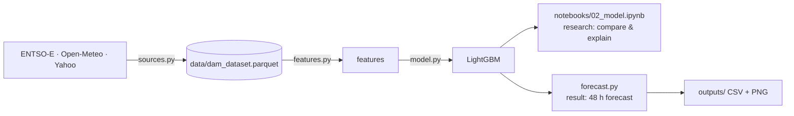

| Path | What it is | Why it's needed |
|---|---|---|
| [`notebooks/01_exploration.ipynb`](notebooks/01_exploration.ipynb) | Exploratory analysis of one year of prices | Decides *what* the model must capture, before any model exists |
| [`notebooks/02_model.ipynb`](notebooks/02_model.ipynb) | Nine years of data, features, five models compared | Shows *which* model wins, and where it fails |
| [`dam_forecast/sources.py`](dam_forecast/sources.py) | Downloads ENTSO-E, Open-Meteo and Yahoo data onto one hourly timeline | One tested way to fetch data, used both for training and for live forecasts |
| [`dam_forecast/features.py`](dam_forecast/features.py) | `make_features()`: turns raw data into model inputs | The no-look-ahead rule lives here. A single copy means the research and the live forecast can't drift apart |
| [`dam_forecast/model.py`](dam_forecast/model.py) | Train, predict, score (MAE / RMSE / sMAPE), save and load | The same recipe in the notebook and in `forecast.py` |
| [`dam_forecast/config.py`](dam_forecast/config.py) | Every setting: feature lists, model parameters, tickers, paths | Change a setting in one place, not in five |
| [`forecast.py`](forecast.py) | The command-line program: `predict` and `train` | The "result": a forecast without opening Jupyter, ready to schedule daily |
| [`data/`](data) | Cached datasets (2.6 MB for 2017 → 2026) | Everything runs without an API key or a 5-minute download |
| [`models/`](models) | The trained LightGBM + [`meta.json`](models/meta.json) (training range, holdout scores) | `forecast.py predict` needs a trained model. `meta.json` shows how good it is |
| [`docs/figures/`](docs/figures) | Every chart in this README | **Written by the notebooks themselves**, so each image traces back to one notebook cell |
| `outputs/` | Where forecasts land (`forecast_<date>.csv` / `.png`) | Run results; only the example image is committed |
| `requirements.txt` / `requirements-lstm.txt` | Pinned Python packages | One-step install. TensorFlow (~500 MB) is separate because only the optional LSTM needs it |
| `.env.example` | Template for the ENTSO-E key | The real key goes in `.env`, which git ignores, so secrets are never committed |

---

## 3. Quickstart

No API key needed. Python 3.12.

```bash
git clone https://github.com/alexkarageorgiev/bg-dam-forecast.git && cd bg-dam-forecast
python3.12 -m venv .venv && source .venv/bin/activate
pip install -r requirements.txt

python forecast.py predict --demo    # replay a recent day offline: table + chart in outputs/
jupyter lab notebooks/               # the research, top to bottom
```

| Command | What it does | Key? |
|---|---|---|
| `python forecast.py predict --demo` | Replays the most recent day in the dataset, compared with the actual prices | no |
| `python forecast.py predict --date 2026-06-15` | Replays any day since Feb 2017; the model is retrained on data up to that day only | no |
| `python forecast.py predict` | Live forecast for tomorrow and the day after | yes |
| `python forecast.py train [--refresh]` | Retrains and saves the model (`--refresh` re-downloads 2017 → today first) | only with `--refresh` |

On GitHub, the notebooks render with static figures. Run them locally for the interactive Plotly versions.

---

## 4. Choosing the data

The brief suggested four kinds of data. For automated forecasting, what matters is not whether data is
*visible* but whether a program can fetch it reliably every morning.

| Source | Visible | Manual download | Machine-readable | API | Automatable | Used |
|---|:-:|:-:|:-:|:-:|:-:|---|
| **IBEX** (the Bulgarian exchange) | ✅ | ✅ | ✅ (Excel) | ❌ none documented | ⚠️ scraping only | no: same prices via ENTSO-E |
| **ENTSO-E Transparency Platform** | ✅ | ✅ | ✅ (XML) | ✅ free token | ✅ | BG price (target); day-ahead load, wind and solar **forecasts**; GR and RO prices |
| **Open-Meteo** | ✅ | ✅ | ✅ (JSON) | ✅ no key | ✅ | Sofia temperature, wind, radiation, cloud (archive for training, forecast for live runs) |
| **Yahoo Finance** (`yfinance`) | ✅ | ✅ | ✅ | ⚠️ unofficial | ⚠️ tickers can disappear | TTF gas; Brent and carbon fetched, not used |
| **EU carbon price (EUA)** | ✅ | ❌ paid | — | ❌ paid | ❌ | only an ETF proxy (KRBN) is free |

**Why ENTSO-E for the price.** IBEX publishes the auction result but offers no API. ENTSO-E republishes the same
Bulgarian day-ahead price through a documented API. It also carries the grid forecasts and neighbour prices,
so one client covers most of the inputs.

**Forecasts, not actuals.** The load, wind and solar inputs are the *day-ahead forecasts* published before the
auction, not what actually happened. At forecast time, actual values don't exist yet.

<p align="center">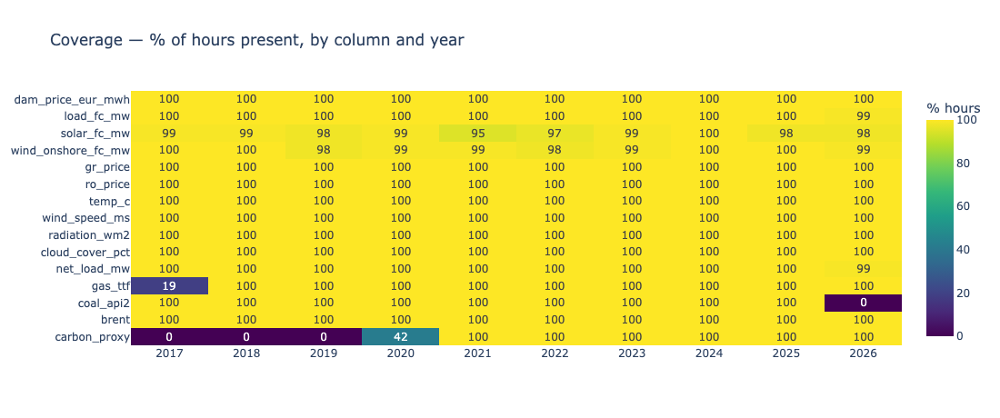</p>

1. **Complete where it matters.** Price, weather and neighbour prices cover 100 % of 2017–2026. The ENTSO-E
   grid forecasts miss 1–5 % of hours in some years.
2. **Fuels are patchy.** TTF gas starts in Oct 2017 and the KRBN carbon proxy in mid-2020. Yahoo **stopped
   publishing API2 coal in Dec 2025**, so coal is dropped: a live forecast could never have it.
3. **The market changed its clock.** On 1 Oct 2025 Bulgaria moved from hourly to 15-minute prices (from 24 to
   96 prints a day). The quarter-hours are averaged to hourly values, which hides a 30 EUR/MWh average spread
   inside each hour. That is a known cost of forecasting hourly.

<p align="center">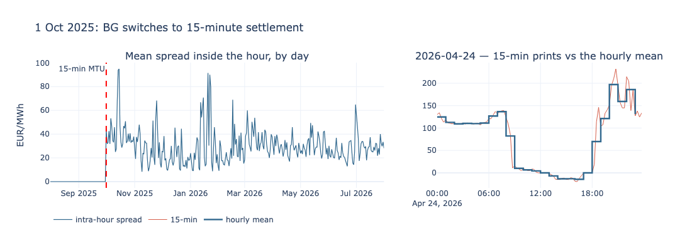</p>

---

## 5. Analysis — what the price actually does

[`01_exploration.ipynb`](notebooks/01_exploration.ipynb) studies one year (Aug 2025 → Jul 2026, 8,760 hours,
no gaps) before any modelling. It asks what shape the price has and what a model must be able to capture.

### The daily and seasonal shape

<p align="center">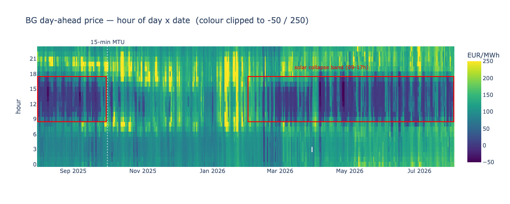</p>

- **Solar collapse.** From February to September, midday prices fall to around zero. From October to January
  the collapse disappears.
- **Evening peak.** 18:00–21:00 averages **1.48×** the annual mean (158.5 EUR/MWh). 09:00–16:00 averages only
  **0.65×** (69.9).
- **Weekly rhythm.** Weekdays average 116 EUR/MWh, weekends 84.

<p align="center">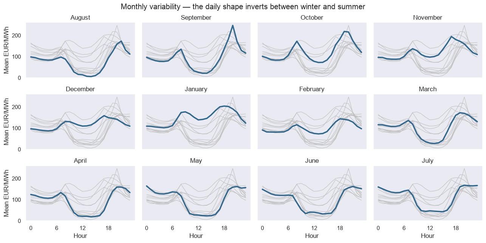</p>

**The daily shape inverts between seasons.** Winter has a morning and an evening hump. Summer has a deep midday
trough. The effect of the hour depends on the month, so the two can't simply be added: a linear model can't
fit this, but a tree model can.

### Two populations, and when the extremes happen

<p align="center">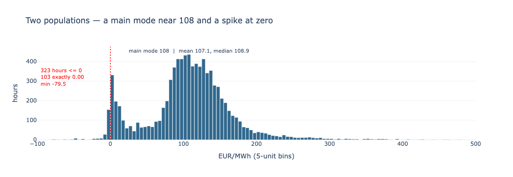</p>

The price has two populations: a main mode near 108 EUR/MWh (mean 107.1) and a spike at zero. **323 hours** were at or
below zero (103 exactly 0.00, the lowest −79.5), and the maximum was 478.9. Because the price hits zero and goes
negative, **MAPE, log targets and Box-Cox are all undefined**, so the project uses MAE, RMSE and sMAPE.

<p align="center">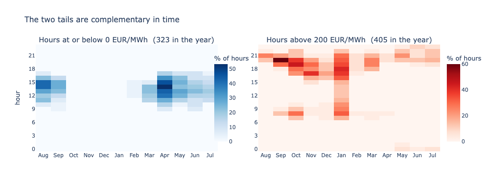</p>

- **Every** hour at or below zero falls between 09:00 and 17:00, only from February to September. That is the
  fingerprint of solar oversupply.
- **66 %** of hours above 200 EUR/MWh fall in 17:00–21:00: the evening ramp after the sun sets.
- **Collapses repeat.** A collapse at the same hour a week earlier raises the chance of another from 3.7 % to
  **45.5 %**.

### Temperature: a correlation that hides two opposite effects

<p align="center">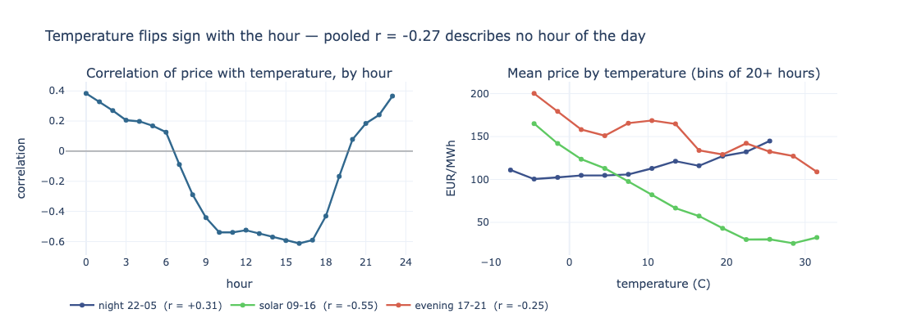</p>

Pooled over all hours, temperature and price correlate at r = −0.27, but that number describes **no actual
hour**. The correlation runs from **+0.38 at midnight** (heating and cooling demand) to **−0.61 at 16:00** (warm,
sunny days mean more solar output and cheaper power). Temperature only makes sense *within* a time of day,
which is another argument for tree models.

### What a 48-hour forecast is allowed to know

<p align="center">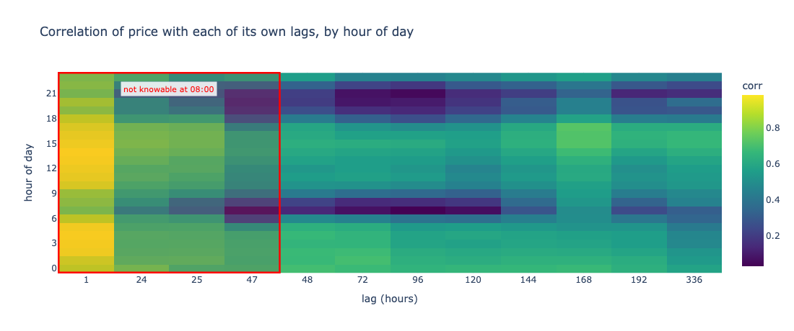</p>

The strongest signal, the price an hour or a day ago, is **not known** when the forecast is made (red box).
The nearest legal lag is 48 h. Over the whole series, the **same hour last week (168 h, r = +0.72) beats the
day before yesterday (48 h, r = +0.64)**. Which lag works best also varies by hour: 48 h wins overnight, 168 h
wins in the afternoon.

### The benchmark to beat

<p align="center">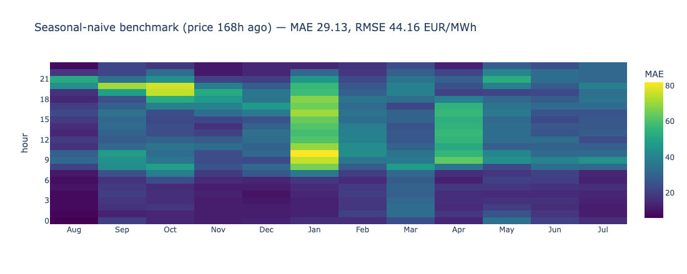</p>

The simplest honest forecast, *"same hour last week"*, scores **MAE 29.1 EUR/MWh**. It is 15.9 at 04:00 but 42.9
at 20:00, and 17.8 in August but 45.3 in January. Any model has to beat it, hour by hour and not only on
average.

---

## 6. Feature engineering

### The rule that makes the metrics honest: no look-ahead

The forecast is made at **08:00 on day D** for every hour of **D+1 and D+2**. A feature may only use what is
published by then:

| Information | Published | Usable as |
|---|---|---|
| BG price for day D | D−1, ~13:00 (the auction) | lags of ≥ 48 h |
| BG price for D+1 | D, ~13:00 | ❌ that is what we forecast |
| Day-ahead load, wind, solar forecasts for D+1 | during D | at its own hour |
| Weather forecast | continuously | at its own hour |
| GR / RO prices | same auction as BG | lags of ≥ 48 h |
| Gas closing price for day D | D evening | from D+1 onwards, then lags of ≥ 48 h |

A 24-hour lag, or a same-hour neighbour price, would quietly use the future and make every score look better
than it really is. The rule is enforced in one function, shown in full in `02_model.ipynb`
([`features.py`](dam_forecast/features.py)).

### The features and why each one should predict the price

| Group | Features | Why it matters |
|---|---|---|
| **Calendar** | hour, weekday, month, weekend, BG public holiday | Demand follows daily, weekly and yearly cycles; holidays behave like Sundays |
| **Price history** | price 48 h, 72 h and 168 h ago | Prices are strongly autocorrelated. The weekly lag carries the weekly shape (§5) |
| **Rolling** | 7-day volatility, 30-day level, 7-day − 30-day trend | Regime and volatility context. The trend is a *difference*, which trees can use even as prices drift |
| **Grid forecasts** | load, wind, solar, **net load** = load − wind − solar | Net load is the demand left for fossil plants, which set the price |
| **Ramps** | 1 h and 3 h change in load / net load | Point at the steep evening climbs where prices spike |
| **Weather** | temperature, wind speed, solar radiation, cloud cover | Drives demand and renewable output; the effect depends on the hour (§5) |
| **Neighbours** | Romania 48 h and 168 h ago, Greece 48 h ago | Bulgaria is coupled with both markets, and prices move together |
| **Fuel** | TTF gas 48 h ago, and its weekly change | Gas plants are often the marginal generator |

Brent, carbon and coal are fetched but not used as features. Brent and carbon added almost nothing in the original research,
and coal can't be fetched live any more.

---

## 7. Model selection

### Candidates and why

| Model | Role | Why try it |
|---|---|---|
| **Seasonal naive**: same hour last week | benchmark | No learning at all: the bar every model must clear |
| **Ridge regression** | simple ML baseline | Linear and easy to interpret |
| **LightGBM** | improved model | Gradient-boosted trees handle the hour × season interactions and non-linear spikes from §5, tolerate missing values, and train in 2 seconds |
| **LSTM** | stretch comparison | A recurrent net reading the last 168 h, to test whether sequence modelling beats trees |

**How they are scored.** The split is by time: models train on 2017 → Apr 2025 and are tested on the most recent
**6 Apr 2025 → 21 Sep 2026 (12,381 hours)**, never shuffled. Shuffling would let a model learn from hours that
come after the ones it is tested on. All models see the same features and the same test hours.

| Model | MAE | RMSE | sMAPE |
|---|---:|---:|---:|
| Seasonal naive | 28.57 | 42.97 | 44.3 % |
| LSTM | 27.85 | 37.10 | 40.6 % |
| LightGBM, residual target | 27.20 | 36.57 | 40.1 % |
| Ridge | 25.24 | 34.69 | 40.8 % |
| **LightGBM** (shipped) | **23.32** | **33.01** | **36.7 %** |

<p align="center">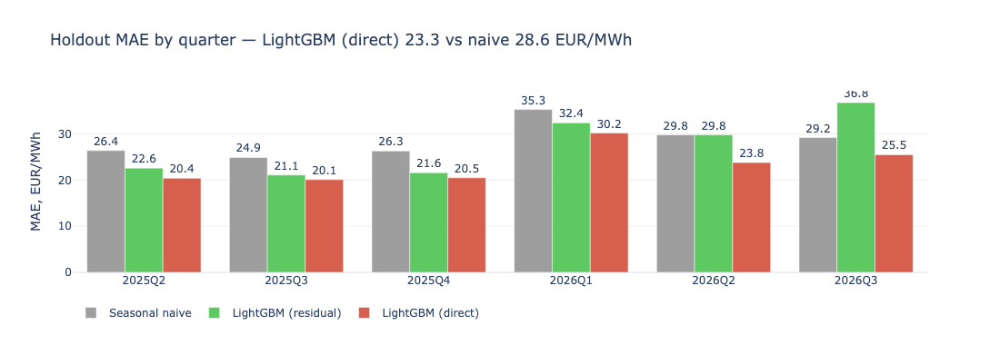</p>

1. **LightGBM wins overall and in every quarter.** MAE 23.3 vs. 28.6 (−18 %). RMSE falls even more (−23 %), so
   the large misses shrink most.
2. **An idea that didn't survive testing.** The first design predicted price *minus its 30-day average* and added
   the average back, to help with trends. Measured, it was worse (27.2) and **fell behind the naive benchmark in
   2026 Q3** (36.8 vs. 29.2): the 30-day average lags behind sudden regime shifts. The shipped model predicts the
   price directly. (Ridge scores the same either way, because the 30-day average is itself one of its features.)
3. **The LSTM lost** to both LightGBM and Ridge. The price drivers are already known as day-ahead forecasts, so
   this is regression with known inputs, where trees are strong, not blind sequence extrapolation.

---

## 8. Results — where the model works and where it doesn't

<p align="center">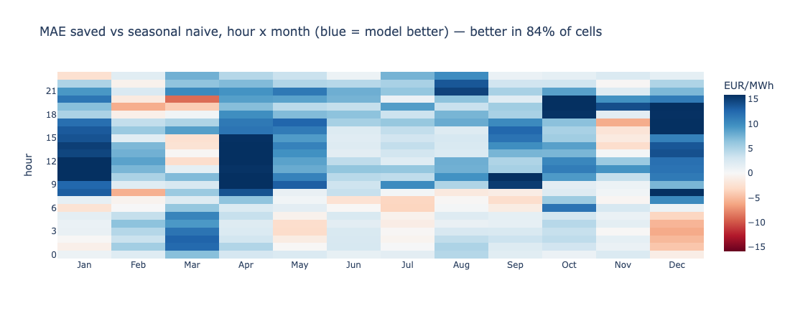</p>

Blue cells are where LightGBM beats the benchmark. It wins in **84 %** of hour × month cells.

| Hours | Naive MAE | LightGBM MAE |
|---|---:|---:|
| Night 22–05 | 18.4 | 15.8 |
| Solar 09–16 | 34.3 | **26.4** |
| Evening 17–21 | 38.5 | 31.2 |
| Price > 200 EUR/MWh | 64.0 | 53.1 |

- **Works well:** at night (MAE 14.2 at 02:00), and in the solar band, where it gains most (34.3 → 26.4). That
  band is where the benchmark struggles, because a midday collapse last week says little about this week.
- **Works poorly:** at the evening peak (MAE 39.0 at 20:00) and on spikes. It **under-calls extremes**: tree
  models average what they have seen, so a 300 EUR/MWh peak comes out nearer 200.

<p align="center">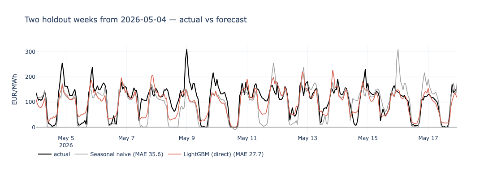</p>

<p align="center">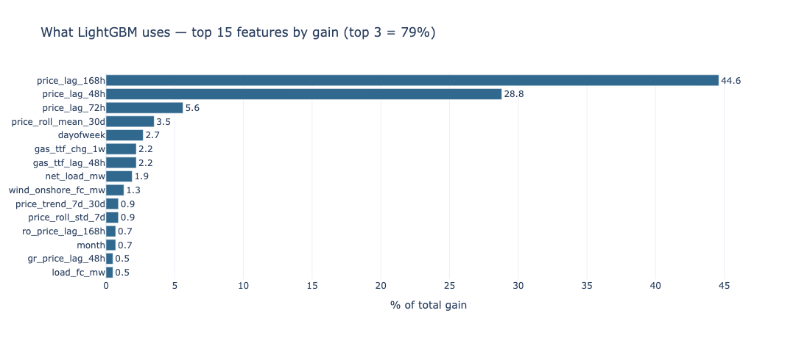</p>

**It is still mostly a lag model.** The 168 h, 48 h and 72 h price lags carry **79 %** of the gain, and the grid
forecasts add little on top. Making those drivers count is the most promising improvement (§11).

**Is it useful for decisions?** For battery or flexible-load scheduling, what matters most is *when* the day is
cheap and when it is expensive. The two-week chart shows the model tracks that shape (the midday trough and the
evening peak) even when it under-calls the height of a spike. It is useful for ranking hours, but not yet for
pricing extreme peaks.

---

## 9. From research to a live forecast

[`forecast.py`](forecast.py) runs the notebook's model on today's data. Run on day D, it:

1. loads the trained model from `models/`;
2. downloads the last 40 days plus the next two, which the 30-day rolling features need (§6);
3. **hides anything not known at 08:00 on D** (prices after D, and grid forecasts for D+2);
4. fills the missing D+2 grid forecasts with the same hour last week, flagged `drivers = fallback_7d`;
5. builds features with the same `make_features()` and predicts all 48 hours;
6. prints a table with the cheapest and most expensive hour of each day, and saves a CSV and a chart to `outputs/`.

**Replays are honest.** `--demo` and `--date` apply the same masking and **retrain the model on data before D
only**, so the replay has never seen the prices it is judged against.

For live mode, register for free at [transparency.entsoe.eu](https://transparency.entsoe.eu), request API
access (email transparency@entsoe.eu, subject "Restful API access"), then `cp .env.example .env` and paste the
token.

---

## 10. Limitations and data quality

- **D+2 grid inputs are estimated.** ENTSO-E publishes grid forecasts one day ahead, so D+2 uses last week's
  values. Replays apply the same rule.
- **Weather differs between training and live runs.** Training uses reanalysis (close to observed weather);
  live runs use forecasts, so replays are slightly optimistic.
- **Evening peaks and spikes are under-called** (§8).
- **Hourly averaging** hides ~30 EUR/MWh of movement inside each hour since the 15-minute switch.
- **Carbon has no clean free source.** KRBN is an ETF proxy, not the EU allowance price.
- **Free tickers can vanish.** Coal disappeared from Yahoo in Dec 2025. The pipeline now treats a stale series as
  missing rather than carrying a frozen price forward.
- **A single weather point.** Sofia stands in for the whole country.

---

## 11. Next steps

1. **Model:** the ideas the exploration pointed to (§5): hour × month interactions, a separate classifier for the
   price ≤ 0 hours (classify, then regress), temperature per time-of-day block, and features that make the grid
   forecasts count (solar × hour, net load on the evening ramp, several weather points).
2. **Blynk dashboard:** show the 48-hour forecast next to actual prices, the key inputs, and the cheap and
   expensive windows. `forecast.py` already writes each forecast to a CSV that the dashboard can read.
3. **Raspberry Pi automation:** retrain on a PC (`python forecast.py train --refresh`) and copy
   `models/lgbm.joblib` to the Pi. A cron job then runs `python forecast.py predict` daily at 08:00 and pushes the
   result to Blynk. The code is already split this way: training and forecasting are separate commands, and the
   model is a single file.

---

*Built as an internship project. MIT licence.*
